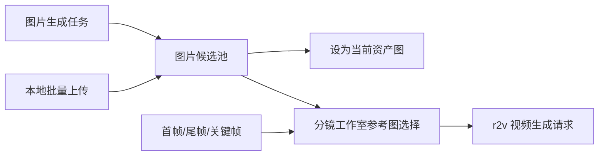

# Jellyfish 多参考图与资产图片管理优化设计

## 状态

- 日期：2026-06-04
- 阶段：Phase A/B 已落地，Phase C 待推进
- 范围：资产管理、图片生成结果保留、本地图片批量导入、r2v 多参考图视频生成
- 结论：建议作为“资产图片候选池 + 批量上传 + r2v 多参考图”的同一阶段能力包推进

## 背景

当前用户反馈集中在三个功能型问题：

1. `happyhorse-1.0-r2v` 最多支持 9 张参考图，但当前视频生成体验仍围绕首帧、尾帧、关键帧的固定组合，无法让用户充分利用多张角色、场景、道具、服装或镜头参考图。
2. 资产管理中多次生成图片后，用户感知为“第二张覆盖第一张”，缺少可回看、可比较、可选择的图片候选池。
3. 资产管理缺少批量上传本地图片能力，用户无法把已有素材快速放入资产图片候选集中。

这三个问题本质上都围绕“图片资产如何沉淀、复用与参与视频生成”。如果分别实现，容易出现重复入口和职责边界混乱；如果统一处理，可以让资产图片从“单个当前图”升级为“当前采用图 + 候选图片池”，再由视频生成流程从候选池中选择最多 9 张参考图。

## 目标

- 资产管理不再丢失生成结果：一次图片生成返回多张图时，全部保留为候选。
- 已采用图片与候选图片分离：当前资产图仍是稳定展示图，历史生成图和本地上传图作为可选候选存在。
- 支持批量上传本地图片：在资产管理列表页按当前类型批量创建资产，并把上传图片设为新资产当前图。
- 支持 r2v 多参考图：视频生成可选择 1 到 9 张参考图，并按用户排序提交给供应商。
- 保持页面职责清晰：资产管理负责图片沉淀与选择，分镜工作室负责视频参考图选择与生成。
- 任务中心保持轻量：不展示图文映射细节，不变成业务详情面板。

## 非目标

- 本阶段不加入完整新手 Wizard。
- 本阶段不把资产管理改造成复杂素材库管理系统，例如标签检索、智能去重、素材版权流程等。
- 本阶段不改变 `shot.status` 的语义；它仍只表达分镜信息提取确认状态。
- 本阶段不要求任务中心展示图片候选、提示词上下文或视频参考图映射。
- 本阶段不对已固化 release note 做修改。

## 总体设计

推荐分三步落地：

1. 资产图片候选池：先解决“生成结果被覆盖”和“候选不可选”的根问题。
2. 批量本地上传：复用候选池，把本地图片作为候选来源之一。
3. r2v 多参考图：从已沉淀的图片候选池和镜头帧图中选择最多 9 张参考图参与视频生成。

核心模型关系：

## 设计一：资产图片候选池

### 当前问题

现有资产图片结构更接近“一个角度或质量等级对应一个当前图”。当图片生成任务返回多张图片时，后端只持久化第一张并更新当前 `file_id`，导致用户无法比较所有生成结果，也容易误以为后续生成覆盖了旧图。

### 目标行为

- 每次图片生成返回的所有图片都要保存为 `FileItem`。
- 每张保存下来的图片都要关联到对应资产图片槽位，成为候选。
- 当前资产图只代表“已采用图片”，不代表全部历史图片。
- 若当前资产图为空，可以自动采用本次生成的第一张图，降低空白状态成本。
- 若当前资产图已有值，新的生成结果默认只进入候选池，不自动覆盖当前图。
- 用户可以在候选池中点击“设为当前图”，显式更新当前资产图。

### 候选来源

- 图片生成任务产物。
- 本地上传图片。
- 后续可扩展到外部素材导入、截图、关键帧回流等来源。

### 数据建议

优先把“当前采用图”和“候选图片”拆开表达：

- 现有 `ActorImage`、`SceneImage`、`PropImage`、`CostumeImage`、`CharacterImage`、`ShotFrameImage` 继续作为当前图片槽位。
- 新增或规范化一个图片候选关联层，用于记录候选图片与目标图片槽位的关系。
- 候选记录至少包含：
  - `target_type`：候选归属类型，例如 `scene_image`、`prop_image`、`shot_frame_image`。
  - `target_id`：目标图片槽位 ID。
  - `file_id`：候选图片文件。
  - `source_type`：`generation` 或 `upload`。
  - `source_ref`：任务 ID、上传批次 ID 或其他来源标识。
  - `is_adopted` 或通过目标槽位 `file_id` 反推是否当前采用。
  - `created_at`：用于候选排序。

如果现有任务链接表已经能稳定表达“任务产物关联到图片槽位”，可以先复用该表作为候选来源；但前端应通过明确的候选查询接口消费，避免继续把任务链接细节泄漏到页面逻辑里。

### 后端行为

- 图片任务落库时遍历 `result.images`，而不是只取第一张。
- 每张图片创建独立 `FileItem`。
- 每张图片创建候选关联。
- 当前图片槽位为空时，自动采用第一张候选。
- 当前图片槽位不为空时，不覆盖；只追加候选。
- 重复执行或重试时应尽量避免重复候选，可通过任务 ID、图片 URL 摘要或文件摘要做幂等保护。

### 前端行为

资产编辑页展示两个层次：

- 当前图：用于资产卡片、资产预览和默认引用。
- 候选图：展示历史生成图和本地上传图，支持预览、选择、设为当前图、删除候选关系。

候选池文案应强调“可选结果”，避免让用户误解为所有图片都会自动替换当前图。

## 设计二：资产列表页批量上传本地图片

### 入口

在资产管理列表页的“新建”按钮旁增加“批量上传”入口。当前 tab 决定创建资产类型：

- 演员 tab 上传后创建演员资产。
- 场景 tab 上传后创建场景资产。
- 道具 tab 上传后创建道具资产。
- 服装 tab 上传后创建服装资产。

当前版本采用文件选择多选。每张图片创建一个资产，资产名称取文件名并去掉扩展名。

### 后端接口策略

当前已有单文件上传接口，可以作为第一版基础：

- 前端逐个调用现有上传接口。
- 上传成功后，用返回的 `file_id` 创建新资产的当前图。
- 若需要更好的批量错误返回和事务语义，再新增批量上传接口。

当前已复用 Phase A 的候选关联接口：

- 前端逐个调用单文件上传接口。
- 每个文件创建一个资产，默认 `view_count = 1`。
- 读取或创建新资产的正面图片槽位，并把上传图片写为当前图。
- 同步调用候选关联接口写入 `source_type = upload`，候选池可识别“本地上传”并标记当前采用。
- 不新增 OpenAPI 契约，前端继续使用 generated client。

### 采用规则

- 列表页批量上传会创建新资产，因此上传图片直接成为该新资产当前图。
- 既有资产不受影响，不会被批量上传覆盖。
- 资产编辑页仍可通过候选池查看该上传图片，并继续选择其他候选作为当前图。

## 设计三：r2v 多参考图视频生成

### 当前问题

当前视频生成请求虽然包含 `images` 数组，但 `reference_mode` 仍是固定枚举：

- `first`
- `last`
- `key`
- `first_last`
- `first_last_key`
- `text_only`

后端校验会按模式要求图片数量精确匹配，运行参数也只映射到 `first_frame_base64`、`last_frame_base64`、`key_frame_base64`。因此即使供应商支持最多 9 张参考图，系统也无法表达多参考图请求。

### 目标行为

- 保留原有固定模式，确保已有首帧、尾帧、关键帧流程兼容。
- 新增多参考图模式，例如 `multi_reference`。
- `multi_reference` 下允许 1 到 9 张图片。
- 图片顺序由用户在前端调整，后端按顺序提交给供应商。
- 供应商不支持多参考图时，前端和后端都应给出明确不可用状态。

### 契约建议

后端请求：

- `reference_mode` 增加 `multi_reference`。
- `images` 在 `multi_reference` 下允许 1 到 9 张。
- 其他模式继续使用现有精确数量校验。

内部契约：

- `VideoGenerationInput` 增加 `reference_images_base64: list[str]` 或等价字段。
- 固定模式可以继续填充 `first_frame_base64`、`last_frame_base64`、`key_frame_base64`。
- 多参考图模式通过 `reference_images_base64` 传递完整图片列表。

供应商适配：

- `happyhorse-1.0-r2v` 下，把多张图片逐张映射为供应商 `reference_image` 输入。
- 保留最大数量校验，默认上限 9。
- 若供应商返回失败，需要在任务错误中保留供应商错误摘要，便于回查。

### 前端交互

分镜工作室的视频生成区域增加多参考图选择能力：

- 固定模式仍提供：首帧、尾帧、关键帧、首尾帧、文本生成等。
- 增加“多参考图”模式。
- 多参考图模式下展示参考图选择器：
  - 默认推荐首帧、尾帧、关键帧。
  - 可从资产当前图、资产候选图、镜头帧图中添加。
  - 显示已选数量，例如 `4 / 9`。
  - 支持移除与排序。
  - 超过 9 张时禁止继续添加。
- 提交前提示缺图、重复图或供应商不支持等问题。

分镜工作室继续保持“生成”定位，不承担资产候选修正的主职责。若发现资产缺图，应该引导用户回资产管理或分镜编辑页补齐，而不是在任务中心展开复杂配置。

### 视频准备度

`video-readiness` 需要独立判断多参考图模式：

- `multi_reference` 至少 1 张图。
- `multi_reference` 最多 9 张图。
- 所选图片必须有可访问的 `file_id` 或可转换为可提交的数据。
- 如果供应商或模型不支持多参考图，应标记为不可生成。

`shot.status = ready` 不等于视频一定可生成。视频生成准备度仍由 `video-readiness` 单独表达。

## API 与 OpenAPI 影响

本阶段会涉及 API 或类型契约变化：

- 若新增候选查询、候选关联、候选删除接口，需要同步 OpenAPI。
- 若 `reference_mode` 增加 `multi_reference`，需要同步 OpenAPI。
- 前端必须使用 generated client，不新增手写 service 封装。
- 完成后必须运行 `pnpm run openapi:update`，并提交 generated types 的变化。

如果第一阶段只改后端任务落库逻辑并复用现有任务链接查询，不改变公开接口，则可以暂时不更新 OpenAPI；但 r2v 多参考图阶段必然需要更新。

## 页面职责边界

- 资产管理：负责资产图片生成、上传、候选保留、设为当前图。
- 分镜编辑页：负责资产/对白提取确认、补缺和修正。
- 分镜工作室：负责视频参考图选择、视频准备度检查和视频生成。
- 任务中心：只展示任务状态、进度、失败、取消、回跳入口。

这组调整不改变前一阶段已经确认的主流程：

1. 章节内容提取分镜。
2. 分镜编辑页完成资产/对白准备。
3. 分镜工作室选择关键帧、参考图、视频参数。
4. 分镜工作室发起视频生成。

## 分阶段实施计划

### Phase A：资产图片候选池

- 调整图片生成任务结果持久化逻辑，保存全部生成图。
- 建立候选图片关联能力。
- 当前图为空时可自动采用第一张；非空时不覆盖。
- 资产编辑页展示候选池并支持设为当前图。
- 增加后端单元测试和前端类型校验。

### Phase B：本地批量上传

- 已在资产管理列表页“新建”旁增加“批量上传”入口。
- 每张上传图片创建一个当前 tab 类型的新资产，名称取去扩展名后的文件名。
- 新资产默认 `view_count = 1`，上传图写为正面当前图，并同步创建 `upload` 来源候选关联。
- 展示上传中状态和成功 / 失败数量。
- 资产编辑页槽位内不再提供上传入口，只保留生成与候选池选择。
- 复用候选池相关测试验证上传来源候选行为。

### Phase C：r2v 多参考图

- 扩展视频生成请求契约，增加 `multi_reference`。
- 扩展内部视频生成输入，支持图片列表。
- 扩展供应商适配，把 1 到 9 张图片提交给 r2v。
- 分镜工作室增加多参考图选择、排序、数量限制和准备度提示。
- 同步 OpenAPI 与 generated client。

## 测试计划

后端：

- 图片生成返回多张图时，所有图片都创建 `FileItem`。
- 多张生成图都进入目标图片槽位候选池。
- 当前图为空时自动采用第一张候选。
- 当前图已有值时追加候选但不覆盖。
- 重试同一任务不产生重复候选。
- 批量上传后所有成功文件创建对应资产，并进入新资产正面图候选池。
- `multi_reference` 下 1 到 9 张图片校验通过。
- `multi_reference` 下 0 张或超过 9 张校验失败。
- r2v 供应商请求包含所有参考图。

前端：

- `pnpm exec tsc --noEmit`。
- 资产编辑页能展示当前图与候选图。
- 候选图可设为当前图。
- 批量上传后资产列表刷新，新资产卡片显示上传图。
- 多参考图模式能添加、移除、排序图片。
- 多参考图数量上限可见且不可突破。

文档：

- 若页面职责或状态语义落地变化，更新 `site/content/docs/architecture/`。
- 尚未落地的阶段计划更新到 `site/content/docs/plans/`。

## 风险与取舍

- 如果继续只使用任务链接表表达候选，前端查询可能仍然绕过清晰领域语义。建议至少提供一个语义明确的候选查询/关联服务。
- 如果图片生成后仍自动覆盖当前图，会继续造成用户感知上的结果丢失。建议只在空槽位时自动采用。
- 多参考图会改变视频生成请求契约，必须同步 OpenAPI 与 generated client。
- 上传图片数量和大小可能带来性能压力，前端需要限制并发，后端需要延续文件大小和类型校验。
- 多参考图的排序会影响生成结果，前端必须让顺序显性可见。

## 待确认决策

1. 当前图非空时，新生成图片是否完全不覆盖当前图？已采用：不覆盖，只进候选池。
2. 空槽位时，第一张生成图是否自动设为当前图？已采用：自动设为当前图。
3. 批量上传图片是否默认只进候选池？已调整：列表页上传会新建资产并直接采用上传图。
4. 多参考图模式命名是否使用 `multi_reference`？推荐：使用该枚举值，语义清晰且兼容旧模式。
5. 候选池是否新增独立公开接口？已采用：新增语义明确的候选接口，避免前端长期依赖任务链接细节。
