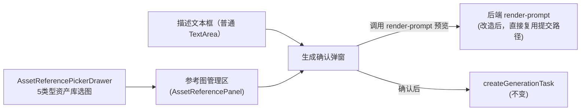

# 资产图片生成接入跨资产融图参考图设计

## 状态

- 日期：2026-07-05
- 阶段：待实施
- 范围：资产编辑页（角色/演员/场景/道具/服装）图片生成功能

## 背景

分镜工作室的关键帧生成（`ShotKeyframeGenerateModal.tsx` + `AssetPickerDrawer.tsx`）已经支持"从资产库挑选其他资产图片作为参考图，多图融合生成"的完整交互：参考图卡片支持拖拽排序、替换、移除，选中资产库图片作为临时候选（不落库业务关联），生成前有提示词/参考图预览。

资产编辑页（`AssetEditPageBase.tsx`）目前也有一种融图能力，但交互很原始：用户需要在描述文本框里输入 `@`，从弹出菜单里选资产分类和具体图片，插入一个不可编辑的图片 chip；chip 对应的 `file_id` 被收集进 `mentionedFileIds`，随生成请求一起提交。这套机制功能上等价于融图，但没有独立的参考图管理区（无法预览大图、调顺序、快速替换、批量查看已选参考图），且 `MentionEditor` 支持的资产类型缺了"演员"（`actor`）。

用户希望资产编辑页也拥有和关键帧生成一致的融图体验：用独立的参考图选择/管理区块替代 `@` 提及机制。

## 目标

- 资产编辑页新增独立的参考图管理区块：选择其他资产的代表图作为参考图，支持拖拽排序、替换、移除、预览大图。
- 参考图来源覆盖全部 5 种资产类型：角色（character）、演员（actor）、场景（scene）、道具（prop）、服装（costume）。
- 完全替换现有 `@` 提及融图机制，避免两套入口并存造成用户困惑和维护成本。
- 生成前先预览最终提示词与参考图组合，确认后再真正发起计费生成。
- 顺带修复资产生成 render-prompt 接口的失真问题（现状见"背景问题"），使预览真实可信。

## 非目标

- 不支持引用"当前正在编辑的这个资产自己的历史候选图"（即不做自引用/img2img 局部编辑场景）；参考图必须来自其他资产。
- 不支持在被引用资产的多张角度图/候选图里选择具体一张，只取该资产的代表图（thumbnail）。
- 不对参考图数量设硬性上限（现状代码里也没有，与关键帧一致，实际受限于模型供应商能力）。
- 不改动分镜工作室 / 关键帧生成相关代码（`AssetPickerDrawer.tsx`、`ShotKeyframeGenerateModal.tsx`、`ChapterShotEditPage.tsx` 保持不变）。

## 背景问题：render-prompt 接口现状失真

调研发现资产生成的 render-prompt 接口（`render_actor_image_prompt` / `render_asset_image_prompt` / `render_character_image_prompt`，均在 `backend/app/api/v1/routes/studio/image_tasks.py`）当前实现存在与"预览"语义不符的问题：

- 接口完全忽略请求体里的 `body.prompt` / `body.images`，只调用 `build_xxx_image_base_draft_service(db, user_id, entity_id, image_id)`——这个函数从数据库里已保存的资产 `description` 字段出发，套用 prompt 模板（`build_prompt_with_template`）拼出提示词，并按"非正面视角自动补正面参考图"的规则决定 `images`。
- 而真正发起生成的接口（`create_xxx_image_generation_task`）走的是 `build_xxx_image_submission_payload_service(prompt=body.prompt, images=body.images)`——直接使用请求体传入的原始描述文本（不走模板拼接）和参考图 `file_id` 列表。
- 两条路径逻辑不一致：现有 render-prompt 接口如果被调用，展示的内容和真正生成时用的内容对不上，起不到"预览"作用。这也是为什么当前 `AssetEditPageBase.tsx` 干脆没有调用它。

修复方式：把三个 render-prompt 接口内部改为调用与生成接口相同的 `build_xxx_image_submission_payload_service`，直接返回其 `prompt`/`images`，去掉对 `build_xxx_image_base_draft_service` 的依赖（该函数及其模板拼接、自动补参考图逻辑在这三个接口里不再需要）。

## 总体设计



## 前端设计

### 1. 移除 `@` 提及机制

- `AssetEditPageBase.tsx`：删除 `MentionEditor` 引入、`mentionedFileIds` state、`loadMentionImagesByKind`、`listMentionEntities`/`listMentionEntityImages` 辅助函数。描述框改为普通 `Input.TextArea`（`value={formDesc}`，`onChange` 直接 `setFormDesc`）。
- 删除 `front/src/pages/aiStudio/assets/components/MentionEditor.tsx`（确认无其他引用后整体删除）。

### 2. 新增参考图状态

```ts
type ReferenceImageOption = {
  kind: 'character' | 'actor' | 'scene' | 'prop' | 'costume'
  entityId: string
  entityName: string
  file_id: string
}
const [referenceOptions, setReferenceOptions] = useState<ReferenceImageOption[]>([])
const [referenceFileIds, setReferenceFileIds] = useState<string[]>([])  // 顺序即提交顺序
```

`handleGenerateImage` 里原来的 `images: mentionedFileIds` 改为 `images: referenceFileIds`。

### 3. 新增 `AssetReferencePickerDrawer`

新文件：`front/src/pages/aiStudio/assets/components/AssetReferencePickerDrawer.tsx`。

不直接复用 shots 下的 `AssetPickerDrawer.tsx`，原因：
- 该组件的 `AssetKind` 只有 `scene | actor | prop | costume` 四种，且 `kindToEntityType` 把 `'actor'` 映射到后端 `entity_type='character'`——标签显示"角色"但查询的其实是角色人设资产，并不支持真正的"演员形象"（`actor`）实体类型。
- 该组件强制要求 `projectId`（角色资产在分镜工作室场景下按项目过滤），而资产编辑页面向的是全局资产库，不按项目过滤。

两边语义冲突，硬复用会更绕，新写一个组件职责更清晰。

Props 设计：
```ts
type AssetReferencePickerDrawerProps = {
  open: boolean
  initialKind?: ReferenceImageOption['kind']  // 替换场景可传入被替换项的 kind 定位 tab
  onSelect: (option: ReferenceImageOption) => void
  onClose: () => void
  loading?: boolean
}
```

内部：
- `Segmented` 5 个 tab：角色 / 演员 / 场景 / 道具 / 服装，对应 `entity_type`：`character` / `actor` / `scene` / `prop` / `costume`。
- 复用 `StudioEntitiesService.listEntitiesApiV1StudioEntitiesEntityTypeGet` 做分页 + 搜索防抖（400ms），实现方式参照 `AssetPickerDrawer.tsx` 现成的分页/搜索逻辑。
- 选中资产后从 `thumbnail` 字段解析出 `file_id`（复用 `assets/utils` 里的 `tryExtractFileIdFromUrl`）；若该资产没有可用图片，`message.warning` 提示且不允许选用。
- 去重：若选中资产的 `file_id` 已经在当前 `referenceOptions` 里，跳过新增。

### 4. 参考图管理区（新增子组件，内嵌在描述框下方）

新文件：`front/src/pages/aiStudio/assets/components/AssetReferencePanel.tsx`，仿照 `ShotKeyframeGenerateModal.tsx` 里参考图卡片区的样式（`react-beautiful-dnd` 横向拖拽卡片，项目已引入该依赖）：

- 每张卡片：缩略图（点击放大预览）、资产类型 Tag、资产名称、"替换"按钮（重新打开抽屉，替换该位置的 `file_id`，位置不变）、"移除"按钮。
- 顶部"添加参考图"按钮打开 `AssetReferencePickerDrawer`（新增模式）。
- 拖拽调整 `referenceFileIds` 顺序（顺序仍会影响模型对多张参考图的解读优先级，即使资产提示词里没有"图1/图2"占位符文本）。

### 5. 生成确认弹窗

点击某个角度图片的"生成"按钮时，流程从"直接生成"改为"先预览再确认"：

1. 保存表单（沿用现有 `updateAsset` 调用逻辑）。
2. 调用对应的 render-prompt 接口（`renderActorImagePromptApi...` / `renderAssetImagePromptApi...` / `renderCharacterImagePromptApi...`，根据 `relationType` 三选一），传入当前 `formDesc` 为 `prompt`、`referenceFileIds` 为 `images`。
3. 弹出确认 `Modal`：只读展示返回的最终 `prompt` 文本 + 参考图缩略图（带序号），复用 `PointsCostButton` 展示费用。
4. 用户点击"确认生成"后才真正调用 `createGenerationTask`（复用现有逻辑不变）。
5. 若 `prompt` 为空，render-prompt 允许返回空文本预览（该接口本身不因空 prompt 报错），但确认弹窗"确认生成"按钮保持置灰并提示"请先填写描述"，和现有 `handleGenerateImage` 开头的空 prompt 校验保持一致的用户体验。

## 后端设计

### 改造 `render_actor_image_prompt` / `render_asset_image_prompt` / `render_character_image_prompt`

以 actor 版本为例（asset/character 版本同构改造）：

现状（`backend/app/api/v1/routes/studio/image_tasks.py`）：
```python
async def render_actor_image_prompt(actor_id, body, db, current_user):
    base = await _build_actor_image_base_draft_service(
        db, user_id=current_user.id, actor_id=actor_id, image_id=body.image_id,
    )
    context = _build_asset_image_context_service(base=base)
    derived = _derive_asset_image_preview_service(base=base, context=context)
    return success_response(RenderedPromptResponse(prompt=derived.prompt, images=derived.images))
```

改为：
```python
async def render_actor_image_prompt(actor_id, body, db, current_user):
    submission = await _build_actor_image_submission_payload_service(
        db, actor_id=actor_id, image_id=body.image_id,
        prompt=body.prompt or "", images=body.images,
    )
    return success_response(RenderedPromptResponse(prompt=submission.prompt, images=submission.images))
```

- 直接复用创建任务时已经在用的 `build_xxx_image_submission_payload_service`（`app/services/studio/generation/asset_image/build_submission.py`），预览与真正提交时的逻辑完全一致，不会出现"预览一套、生成又是另一套"的不一致。
- `StudioImageTaskRequest.prompt` 已经是 `Optional[str] = None`，render-prompt 场景不需要像创建任务接口那样强制非空校验，允许空描述预览。
- `RenderedPromptResponse` schema 字段不变（`prompt: str, images: list[str]`），前端生成客户端类型不受影响，**不需要**跑 `pnpm run openapi:update`。
- 改造后 `_build_xxx_image_base_draft_service`（走模板拼接 + 自动补正面参考图那条路径）在这三个 render-prompt 接口里不再被调用；需确认它是否还被其他调用方依赖（初步调研未发现），若确认无其他用途可以考虑一并清理，但**不在本次改动范围内**，本次只改 render-prompt 三个 handler 的内部实现，不删除其依赖的函数本身。

## 数据流与状态一致性

- 参考图选择结果完全是前端临时态：只随本次生成请求提交，不写入任何资产关联关系表——与关键帧生成"临时参考图不落库"的语义完全一致。
- `referenceFileIds` 的顺序在提交请求体 `images: string[]` 里原样保留，多图融合的输入顺序由该数组顺序决定。

## 测试计划

- 后端：为三个改造后的 render-prompt 接口补充/更新单测，断言返回值使用请求体传入的 `prompt`/`images`，而非数据库持久化的资产描述与自动补参考图逻辑。
- 前端：`pnpm exec tsc --noEmit` 必须通过。
- 手动验证（浏览器）：
  - 新建/编辑角色资产 → 从抽屉选场景/道具作为参考图 → 拖拽调整顺序 → 点"生成" → 确认弹窗展示预期 `prompt` + 参考图缩略图 → 确认后生成任务成功创建。
  - 替换、移除参考图卡片正常工作。
  - 资产无可用图片时，选取该资产应报错提示且不能加入参考图列表。
  - 描述为空时，确认弹窗"确认生成"按钮保持置灰。
  - 5 种资产类型（角色/演员/场景/道具/服装）编辑页均可正常使用参考图功能。
